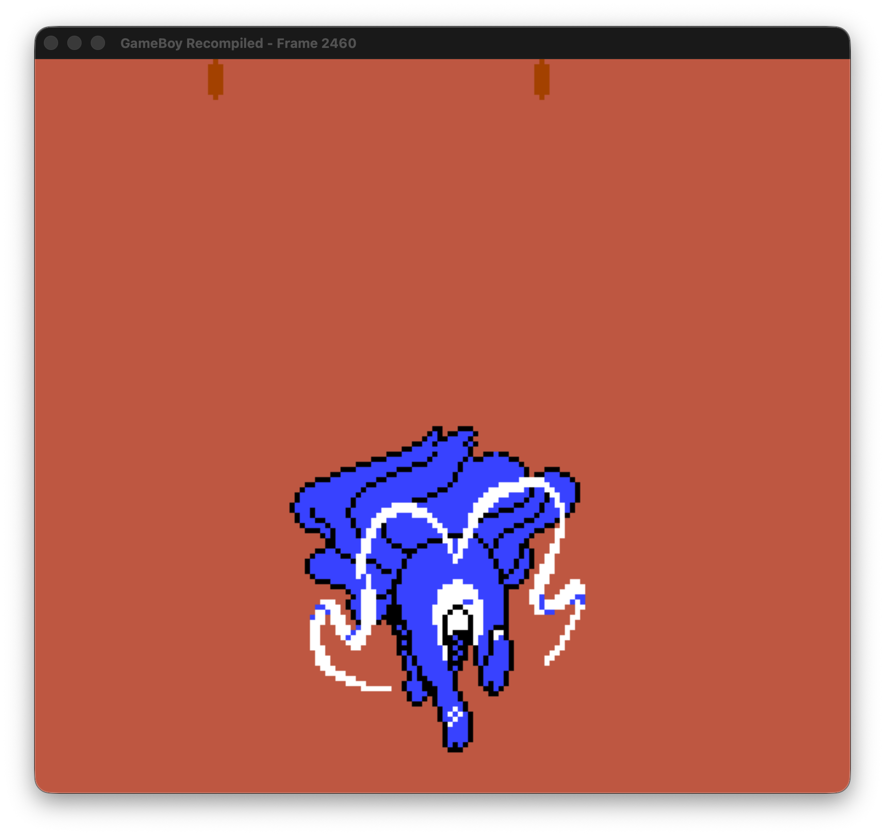
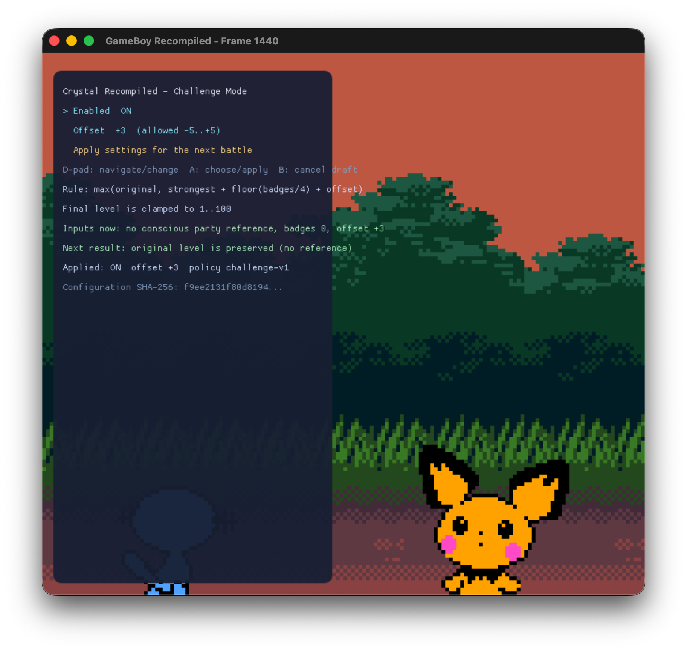

# Crystal Recompiled

Crystal Recompiled is a ROM-free, exact-ROM Pokémon Crystal port built with
[GB Recompiled](https://github.com/arcanite24/gb-recompiled). It uses stable
game semantics to add host-native features while keeping the original game and
hardware state authoritative.

<table>
  <tr>
    <td width="50%"></td>
    <td width="50%"></td>
  </tr>
  <tr>
    <td align="center"><sub>Freshly generated CGB runtime</sub></td>
    <td align="center"><sub>Controller-first Challenge Mode</sub></td>
  </tr>
</table>

The repository contains original code, manifests, schemas, tests,
documentation, licensed replacement assets, and the two documentation captures
above. It does not contain a ROM, save, extracted source asset, generated game
source, or ROM-derived executable.

## What this project demonstrates

- Exact-ROM semantic views over party, boxes, battle state, maps, and saves.
- Transactional native Pokédex and PC tools that preserve Crystal's checksums,
  backup records, and original-function timing.
- Deterministic Challenge Mode rules for reviewed wild and trainer boundaries.
- Versioned ROM-free data mods and a source-built Encounter Lens extension.
- Replay, persistence, fallback, privacy, and release-provenance gates.

## Alpha boundary

This is a source-only fan-project alpha. It accepts only an unmodified
Pokémon Crystal US/Europe Rev 1 ROM, selected and verified locally. The checked
vanilla and Challenge Mode routes pass on macOS arm64; Linux, macOS Intel, and
Windows remain best-effort until the same exact-ROM package checks are completed
on those hosts. The current evidence does not claim whole-game compatibility or
combined physical-controller acceptance.

Pokémon and related names and marks belong to their respective owners. This
unofficial project is not affiliated with, sponsored by, or endorsed by
Nintendo, The Pokémon Company, Game Freak, or Creatures.

## Build locally

Install Python 3, CMake, Ninja, SDL2 development files, and a C/C++ compiler.
Then download and extract the matching SDK from the
[GB Recompiled 0.1.0 release](https://github.com/arcanite24/gb-recompiled/releases/tag/v0.1.0).

Bootstrap the SDK and pinned generation reference:

```bash
python3 ports/pokemon-crystal/scripts/bootstrap.py \
  --distribution /path/to/gb-recompiled-distribution \
  --fetch-references
```

Select the supported ROM and build in the platform's private user cache:

```bash
python3 ports/pokemon-crystal/scripts/first_run.py
```

For a headless setup, add `--rom /path/to/your-rom.gbc`. The selected path and
ROM bytes are not written to source control, receipts, or progress logs. See the
[packaging guide](../PACKAGING.md) for cache locations,
relocation, saves, mods, and uninstall behavior.

## Read next

- [Engineering workflow](../README.md)
- [Challenge Mode](../CHALLENGE_MODE.md)
- [Data mods and Encounter Lens](../mods/README.md)
- [Distribution boundary](../LEGAL.md)
- [Release checklist](../RELEASE.md)
- [Third-party notices](../THIRD_PARTY_NOTICES.md)

## Support boundary

Do not attach ROMs, saves, generated game source, or extracted game assets to
issues or discussions. Reports should include the host, Crystal Recompiled and
GB Recompiled versions, the failing command, and path-redacted diagnostics.
